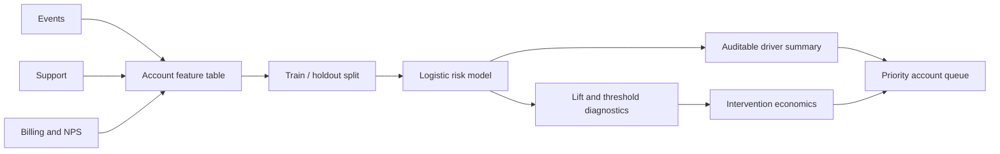

# Retention and Churn Copilot

[](https://github.com/sagarmandavkar-UX/retention-churn-copilot/actions/workflows/tests.yml)


An explainable customer-retention project that connects product behavior, support friction, customer sentiment, revenue, and churn outcomes. It trains a dependency-light logistic model, evaluates it on a holdout set, measures lift, explores threshold tradeoffs, generates auditable risk-driver summaries, calculates intervention economics, and ships cohort-retention SQL.

> Accounts and financial values are seeded synthetic data. Scenario economics are explicit assumptions, not realized revenue claims.

## Executive result

The holdout model reaches roughly **0.79 ROC AUC** and concentrates substantially more churn in the highest-risk decile than the population baseline. At the default 70% score threshold, the dashboard translates targeting volume into revenue at risk, expected saves, intervention cost, and expected net value.

## Business questions

- Which accounts deserve retention review first?
- What observable signals explain elevated risk?
- How much churn is concentrated in the highest-risk group?
- What precision/recall tradeoff follows from each threshold?
- When does an intervention create positive expected value?

## What this project demonstrates

- Account-grain schema validation and duplicate prevention.
- Logistic regression implemented with iteratively reweighted least squares.
- Deterministic train/holdout split and holdout ROC AUC.
- Risk-decile lift table and threshold precision/recall curve.
- Auditable, deterministic root-cause summaries.
- Threshold-level retention economics with scenario controls.
- Cohort-retention SQL with explicit account-month grain.
- Operational priority queue and interactive dashboard.

## Architecture



## Repository structure

```text
├── pipeline.py              # model, diagnostics, explanations, economics
├── app.py                   # retention command center
├── sql/cohort_retention.sql # production-style cohort query
├── docs/                    # methodology, dictionary, executive memo
├── outputs/                 # model card, lift, threshold curve, queue
├── test_project.py
├── Dockerfile
├── Makefile
└── requirements.txt
```

## Quick start

```bash
git clone https://github.com/sagarmandavkar-UX/retention-churn-copilot.git
cd retention-churn-copilot
python -m venv .venv
source .venv/bin/activate
make setup
make analyze
make test
make dashboard
```

## Modeling and decision boundaries

The score prioritizes human review; it does not authorize autonomous customer treatment. The assumed save rate must be replaced with incremental lift from a randomized retention holdout before financial impact is claimed. Production governance should include protected-class review, subgroup calibration, drift monitoring, treatment eligibility, explanation logging, and override audit trails.

## SQL depth

The cohort query uses CTEs, a first-activity cohort assignment, month offsets, distinct-account denominators, and cohort-size joins. It intentionally keeps cohort maturity visible rather than filling unavailable future months with zero.

## Portfolio talking points

- Evaluated churn ranking on an untouched holdout set and quantified operational lift by risk decile.
- Connected model thresholds to capacity, precision/recall, revenue at risk, and offer cost.
- Kept AI-style root-cause summaries deterministic and auditable rather than fabricating explanations.

See [Methodology](docs/METHODOLOGY.md), [Data dictionary](docs/DATA_DICTIONARY.md), and [Executive memo](docs/EXECUTIVE_MEMO.md).
