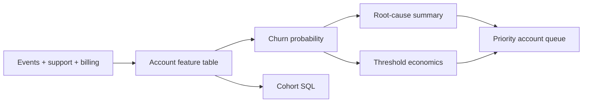

# Retention and Churn Copilot

**Role signal:** AI Data Analyst, customer analytics, SQL, applied machine learning.

## Executive summary

This project scores account churn risk, translates behavioral signals into auditable root-cause text, and compares expected revenue saved with intervention cost. The demo logistic model reaches **0.79 ROC AUC**. At a 70% threshold it targets 173 accounts and estimates **$47.2K net annual value** under explicit save-rate and discount assumptions.

## What ships

- A dependency-light logistic model implemented with iteratively reweighted least squares.
- Account-level risk scores and human-readable behavioral drivers.
- A threshold-based intervention business case.
- Cohort-retention SQL with an explicit account-month grain.
- Outputs for priority accounts and a model card.

Run `python pipeline.py`. The included summary is deterministic and auditable; an optional LLM layer should summarize only retrieved evidence, redact sensitive fields, log prompts/outputs, and require human review before customer outreach.
